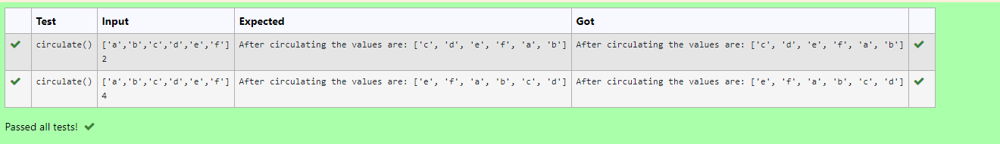

# Circulate-the-values-of-N-variables
## Aim:
To write a python program to circulate the n variables using function concept
## Equipment’s required:
PC
Anaconda - Python 3.7
## Algorithm: 
- Step 1:  
Define the function to circulate variables.
- Step 2:   
Assign the given values in a list.
- Step 3:   
Get the value from the user for the number of rotation
- Step 4:   
Using the slicing concept rotate the list
- Step 5:   
Assign a variable for the new list after slicing and print the variable.
- Step 6:   
End of the program.
## Program:
```
#Program to circulate N values.
#Developed by: ROHIT JAIN D
#RegisterNumber: 212222230120
def circulate():
    l=eval(input())
    n=int(input())
    l=l[n:]+l[:n]
    print("After circulating the values are:",l)
```
## Output:

## Result:
Thus, circulating the n variables is successfully executed.
